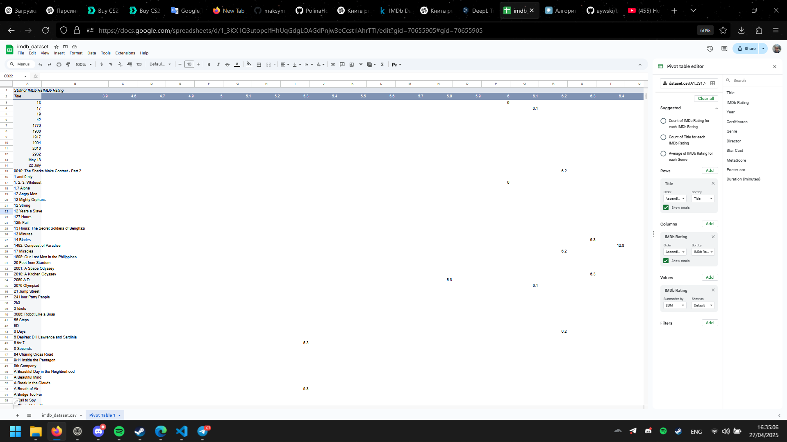
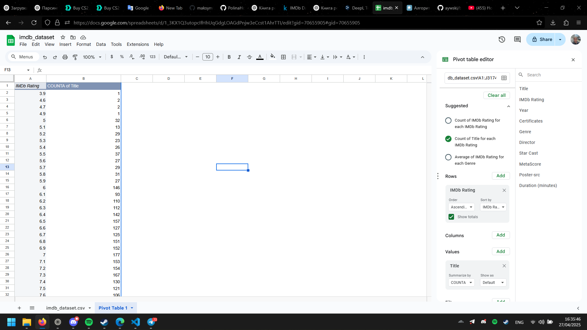
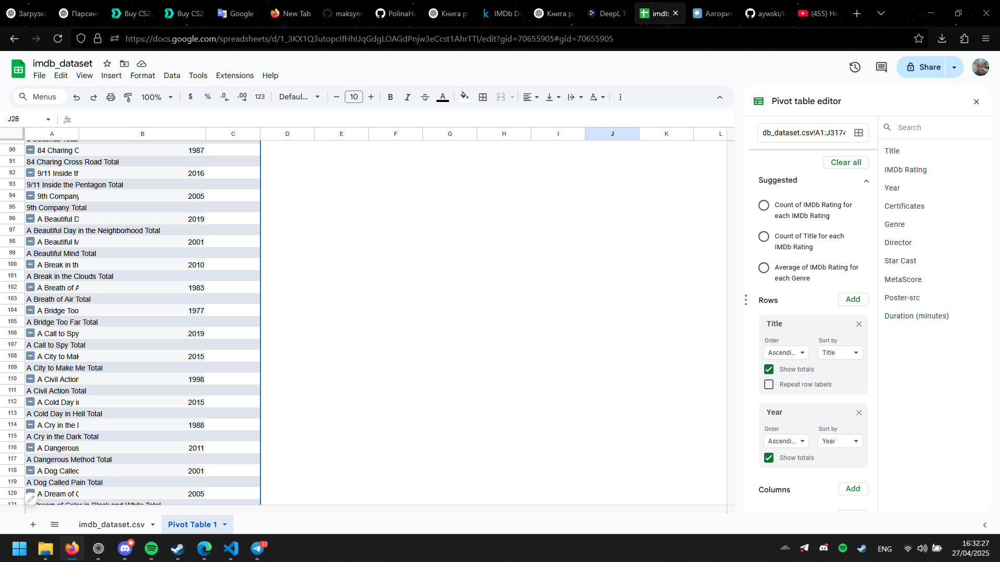

# IMDb Movies Dataset Analysis Report

## Domain Description
The dataset contains movie information from IMDb (Internet Movie Database), which is a comprehensive online database of movie and TV show information including ratings, release years, cast, directors, genres, and more. This dataset appears to be focused on movie titles with their corresponding IMDb ratings and other metadata.

## Original Dataset
**Source**: [IMDb Dataset 2024 (Updated) on Kaggle](https://www.kaggle.com/datasets/parthdande/imdb-dataset-2024-updated/data)

**Description**: The dataset includes detailed information about movies with the following fields:
- Title: Movie name
- IMDb Rating: User ratings from IMDb (scale of 1-10)
- Year: Release year
- Certificates: Content rating certificates
- Genre: Movie categories
- Director: Film director(s)
- Star Cast: Main actors
- MetaScore: Critics' ratings
- Poster-src: Link to movie poster image
- Duration: Length of the movie in minutes

## ETL Process Description

1. **Extraction**:
   - Source data extracted from the IMDb platform via web scraping or API
   - Data downloaded from Kaggle in CSV format
   - Initial validation of data format, completeness, and consistency

2. **Transformation**:
   - Cleansing of movie titles and removing duplicates
   - Normalization of ratings to standard decimal format
   - Extraction of genre tags into separate dimension table
   - Parsing of certificate information into standardized categories
   - Creation of unique identifiers for dimension tables
   - Handling of missing values in MetaScore and other optional fields
   - Conversion of duration to integer minutes format

3. **Loading**:
   - Population of dimension tables (Year, Director, Genre, etc.)
   - Loading fact table with foreign keys to dimensions
   - Creation of appropriate indexes for performance
   - Implementation of constraints to maintain data integrity
   - Creation of aggregate tables for common queries

## Pivot Table Analysis

The Google Sheets screenshots show various pivot table analyses:

### Pivot Table 1 (Image 1):
This pivot table displays movie titles with their corresponding IMDb ratings. We can see the "Count of Title for each IMDb Rating" is selected in the analysis options. The data shows various movies like "12 Angry Men", "Mighty Orphans", and films from different years with their corresponding ratings.

### Pivot Table 2 (Image 2): 
This pivot table focuses on the distribution of IMDb ratings. The left column shows ratings ranging from 3.9 to 7.6, while the right column displays the count of movies with each rating. For example:
- Rating 6.0 has 146 movies
- Rating 6.2 has 110 movies
- Rating 6.4 has 142 movies
- Rating 7.0 has 177 movies

### Pivot Table 3 (Image 3):
This pivot table organizes movies alphabetically with their release years:
- "84 Charing Cross Road" (1987)
- "9/11 Inside the Pentagon" (2016)
- "9th Company" (2005)
- "A Beautiful Day in the Neighborhood" (multiple entries)
- "A Bridge Too Far" (1977)
- "A Call to Spy" (2019)
- "A City to Make Me" (2015)
- "A Civil Action" (1998)
- "A Cold Day in Hell" (2015)

The pivot table editor on the right shows options for organizing data by Title and Year with ascending order and totals displayed.

These pivot tables demonstrate how the IMDb dataset can be analyzed to understand movie rating distributions, count films by year, and organize the catalog in various ways for further analysis.
