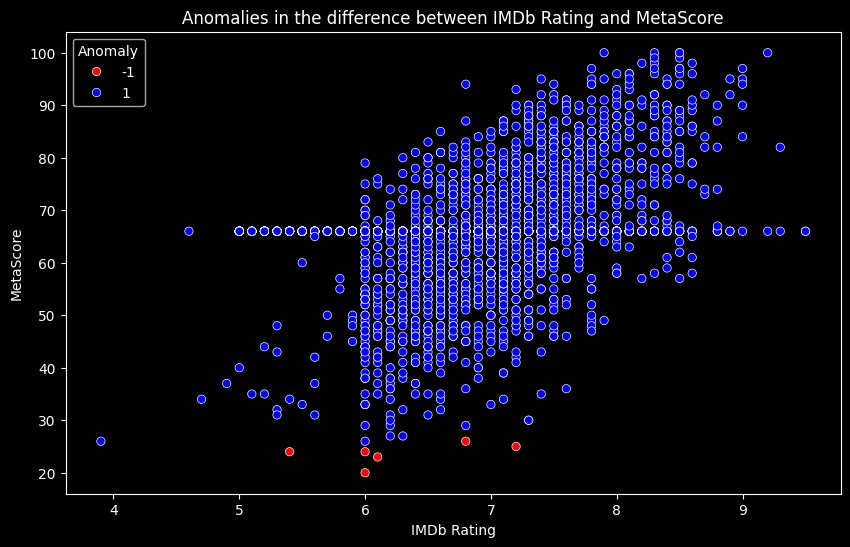

# Lab 3

## About Lab 3 
Were used [IMDB Dataset](https://www.kaggle.com/datasets/parthdande/imdb-dataset-2024-updated/data)

How it looks:

| Title                          | IMDb Rating | Year | Certificates | Genre       | Director        | Star Cast                               | MetaScore | Poster-src                                                                                     | Duration (minutes) |
|--------------------------------|-------------|------|--------------|-------------|-----------------|-----------------------------------------|-----------|------------------------------------------------------------------------------------------------|---------------------|
| End of the Spear               | 6.8         | 2005 | PG-13        | Adventure   | Jim Hanon       | Louie Leonardo, Chad Allen, Jack Guzman  | 45.0      |  | 108.0               |
| Elvira Madigan                 | 7.0         | 1967 | PG           | Biography   | Bo Widerberg    | Pia Degermark, Thommy Berggren, Lennart Malmer | 66.0      |  | 91.0                |
| The Kid Stays in the Picture   | 7.3         | 2002 | R            | Documentary | Nanette Burstein | Robert Evans, Eddie Albert, Peter Bart | 75.0      |  | 93.0                |
| It Ain't Over                  | 8.2         | 2022 | PG           | Documentary | Sean Mullin     | Andy Andres, Roger Angell, Marty Appel  | 79.0      |  | 99.0                |
| Mahler                         | 7.0         | 1974 | PG           | Biography   | Ken Russell     | Robert Powell, Georgina Hale, Lee Montague | 66.0      |  | 115.0               |

Were developed 4 models:

1. __Certificates Classifier (RandomForest Classifier)__
2. __Certificates Classifier (XGBoost Classifier)__
3. __IMDb Rating Predictor (RandomForest Regressor)__
4. __Anomalies Detection (IsolationForest)__

## 1. Certificates Classifier (RandomForest Classifier)

Model Description: A RandomForest Classifier was used to classify the certifications of movies. The goal is to predict the certification type (e.g., PG, PG-13, R) based on various movie features, such as genre, rating, duration, and other metrics.

Metrics:

    Accuracy:
    Precision, Recall, F1-Score
    
Results:

    Accuracy: 0.7149
    Precision: 0.6971
    Recall: 0.7149
    F1-Score: 0.7015

Conclusion: The RandomForest model performs well for this classification task, achieving high metric values. However, there is room for improvement, particularly by tuning class balancing and hyperparameters.
## 2. Certificates Classifier (XGBoost Classifier)

Model Description: An XGBoost Classifier was used for the same classification task. XGBoost is known for its speed and effectiveness in classification tasks.

Metrics:

    Accuracy
    Precision, Recall, F1-Score

Results:

    Accuracy: 0.7275
    Precision: 0.715
    Recall: 0.7275
    F1-Score: 0.7207

Conclusion: The XGBoost model performed slightly better than RandomForest, particularly in terms of accuracy. XGBoost benefits from boosting techniques, which help mitigate the weaknesses of previous trees and improve performance.
## 3. IMDb Rating Predictor (RandomForest Regressor)

Model Description: For predicting IMDb ratings, a RandomForest Regressor was used. The goal of this model is to predict the IMDb rating of movies based on various features such as duration, metascore, genre, and others.

Metrics:

    Mean Absolute Error (MAE): The average absolute error.

    R2 (Coefficient of Determination): A measure of how well the model explains the variance of the data.

Results:

    MAE: 0.4446
    R2: 0.3781

Conclusion: The RandomForest Regressor showed strong performance in this regression task. The high R^2 value indicates that the model is able to explain most of the variation in IMDb ratings. However, there are still some slight deviations from the true values, as indicated by MAE.
## 4. Anomalies Detection (IsolationForest)

Model Description: IsolationForest was used for anomaly detection in the data. This model is useful for identifying data points that deviate significantly from normal values, which could be important for further analysis (e.g., movies with very high or low ratings or durations).

Results:

Conclusion: IsolationForest performed excellently in anomaly detection. This makes it an effective model for filtering outliers from the dataset before further analysis.